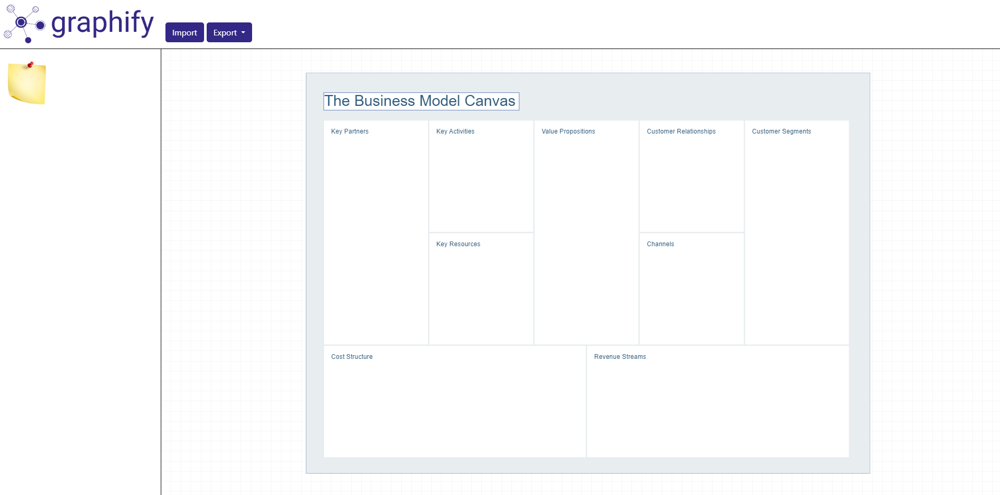

# Graphify

Graphify is a diagramming software designed for creating **Business Model Canvases**, built on the **mxGraph framework**. More features and diagram types are coming soon!

Graphify is live at: [Graphify on Vercel](https://graphify-diagrams.vercel.app)

> **Note**: Development on this project is currently paused, so updates may take some time to be added.

---

## Features

-   **Drag and drop creation**: Easily create diagram components, such as post-its or the BMC model itself, by dragging and dropping icons.
-   **Save diagram as XML or image**: Export your personalized diagrams as XML or image files to your device.
-   **Load existing diagrams**: Import any diagram created with **mxGraph** directly into Graphify.

---

## Screenshot

Here’s a preview of how Graphify looks:



---

## What's Next

-   **User authentication**: Secure login with JWT or OAuth.
-   **Database integration**: Store personalized diagrams in a custom database or integrate with cloud services like Google Drive or OneDrive.
-   **More diagram types**: Add support for additional diagram types, such as BPMN, Service Blueprints, and more.

---

## Technologies Used

-   **Frontend**: Angular
-   **Diagramming Framework**: mxGraph

---

## Development

### Prerequisites

Ensure you have the following installed on your system:

-   **Node.js**: [Download Node.js](https://nodejs.org/)
-   **npm**: Comes with Node.js installation.

### Steps

1. Install dependencies by running the following commands in a terminal:

    ```bash
    cd graphify-web
    npm install
    ```

2. **In another terminal**, start the development server:

    ```bash
    cd graphify-web
    npm run dev
    ```

3. Open your browser and navigate to:

    ```
    http://localhost:3000
    ```

---

## License

[MIT](./LICENSE)
